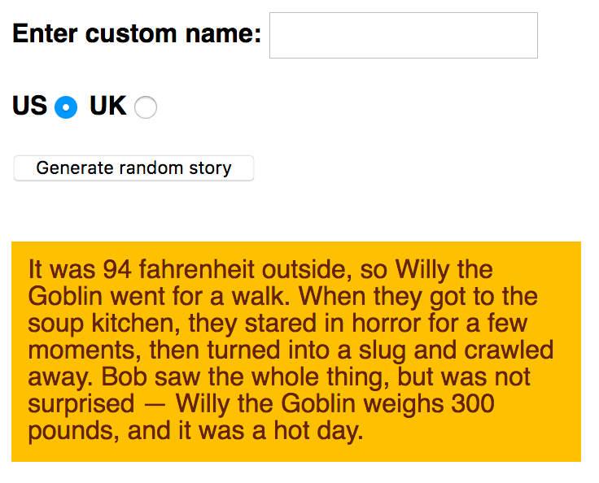

이제 프로젝트 시작을 위해 가공하지 않은 HTML/CSS 그리고 몇몇 텍스트를 만들고 확인했습니다.  
이제 아래와 같은 기능을 하는 프로그램을 만들기 위해 JavaScript를 코딩해야 합니다.

### 요구사항
1. "Generate random story" 버튼를 누를 때 마다 꾸며진 이야기를 만들어야 합니다. 
2. 생성 버튼을 누르기 전에 "사용자 지정 이름 입력" 텍스트 필드에 사용자 지정 이름을 입력한 경우에만 스토리의 기본 이름인 "Bob"을 사용자 지정 이름으로 바꿉니다. 
3. 생성 버튼을 누르기 전에 영국 라디오 버튼을 선택한 경우 스토리의 기본 미국 무게 및 온도 수량과 단위를 영국 단위로 변환합니다. 
4. 버튼을 누를 때마다 새로운 꾸며진 스토리를 무작위로 생성합니다. 

